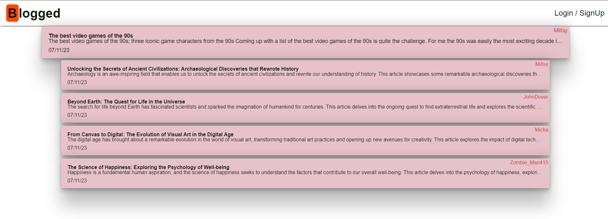
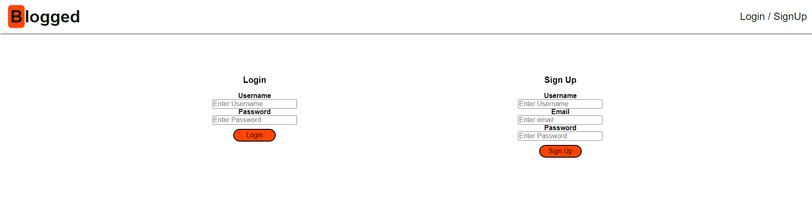
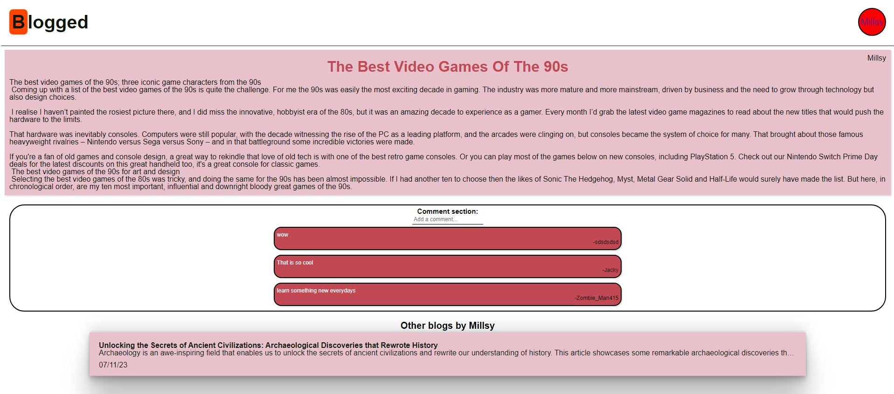
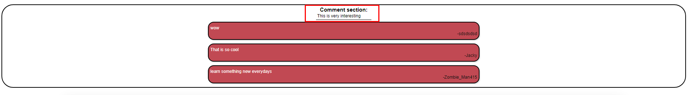
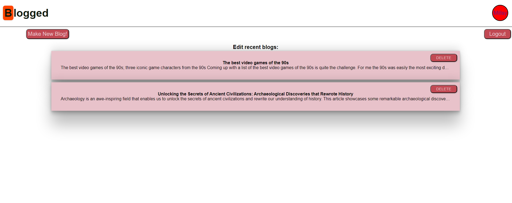
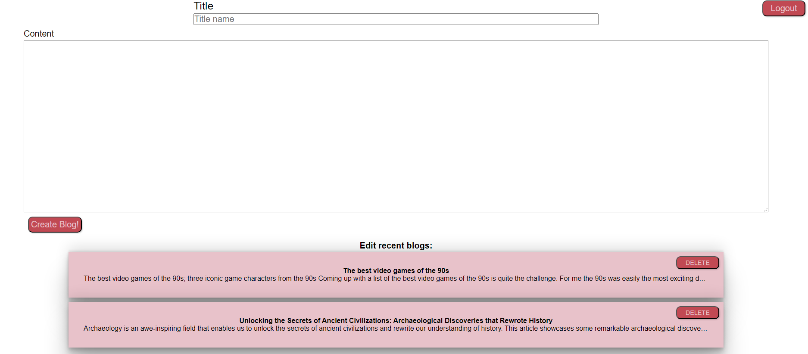
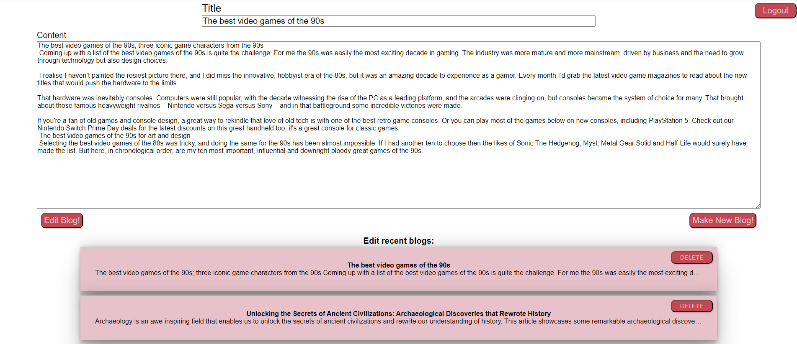
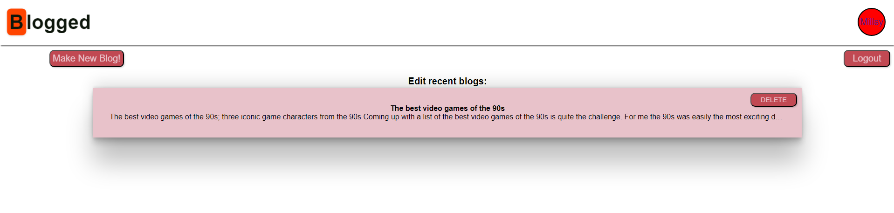

# Blog-CMS-MVC

A blog site with a Content Management System Style using Model View Controllers to interact with the website.

## Table of Content

- [Webiste](#walkthough)
- [User Story & Acceptance Criteria](#user-story)
- [What I have learnt](#what-i-have-learnt)
- [Installation](#installation)
- [Test](#test)
- [Usage](#usage)

## Website

[Blogged](https://blogged-493c75ec6321.herokuapp.com/)

## User Story

```md
AS A developer who writes about tech
I WANT a CMS-style blog site
SO THAT I can publish articles, blog posts, and my thoughts and opinions
```

## Acceptance Criteria

```md
GIVEN a CMS-style blog site
WHEN I visit the site for the first time
THEN I am presented with the homepage, which includes existing blog posts if any have been posted; navigation links for the homepage and the dashboard; and the option to log in
WHEN I click on the homepage option
THEN I am taken to the homepage
WHEN I click on any other links in the navigation
THEN I am prompted to either sign up or sign in
WHEN I choose to sign up
THEN I am prompted to create a username and password
WHEN I click on the sign-up button
THEN my user credentials are saved and I am logged into the site
WHEN I revisit the site at a later time and choose to sign in
THEN I am prompted to enter my username and password
WHEN I am signed in to the site
THEN I see navigation links for the homepage, the dashboard, and the option to log out
WHEN I click on the homepage option in the navigation
THEN I am taken to the homepage and presented with existing blog posts that include the post title and the date created
WHEN I click on an existing blog post
THEN I am presented with the post title, contents, post creator’s username, and date created for that post and have the option to leave a comment
WHEN I enter a comment and click on the submit button while signed in
THEN the comment is saved and the post is updated to display the comment, the comment creator’s username, and the date created
WHEN I click on the dashboard option in the navigation
THEN I am taken to the dashboard and presented with any blog posts I have already created and the option to add a new blog post
WHEN I click on the button to add a new blog post
THEN I am prompted to enter both a title and contents for my blog post
WHEN I click on the button to create a new blog post
THEN the title and contents of my post are saved and I am taken back to an updated dashboard with my new blog post
WHEN I click on one of my existing posts in the dashboard
THEN I am able to delete or update my post and taken back to an updated dashboard
WHEN I click on the logout option in the navigation
THEN I am signed out of the site
WHEN I am idle on the site for more than a set time
THEN I am able to view posts and comments but I am prompted to log in again before I can add, update, or delete posts
```

## What I have Learnt

This was a very dense challenge, it had a ton of features that you had to implement and becomes my first full stack website that people would actually be able to use and post on which is great and very rewarding. There were many challenges that I fell into while creating this Blog app. For instance, getting my SQL database to be hosted in the cloud instead of locally was a confusing indevour as there so many ways to do so. I went with the option of setting it up with ClearDB because that was the most recommended when I went onto Heroku. Secondly, getting the website to feel fluid and making all the calls to the API work properly was a real headache at some points because of all the redirecting you need to do if they aren't logged in or idling.

On the other hand, it was very enjoyable to create this website as it was my first look and creation of full stack development and also it was the first time you had to really learn on your own properly because of the all the errors and problems you would constantly run into when developing. It was enjoyable to fix all the errors that kept occuring and get to the end product.

## Installation

Pull down the project:

```bash

git clone https://github.com/AMillsy/Blog-CMS-MVC.git

```

Install the packages:

```bash

npm i

```

Create a .env file and copy the [Example ENV](./env.EXAMPLE)

Make sure to name your database the same in the [Schema](./db/schema.sql) the same as the DB_NAME in your ENV file.

Seeding Data:
If you want to use the seeding data which will populate the website then do

```bash

npm run seed

```

Run the project:

Start: node

Dev: nodemon -- Not installed in the project.

```bash

npm run start

OR

npm run dev

```

## Usage

### Homepage

You are present with the homepage with the most recent blogs



### Login/Signup

If you aren't logged in, then you will prompted to login when you try to access any blog or press SignUp



### Blogs

When you have logged in, you are able to access all the blogs, which has the blog, comments and other blogs by that user.



### Comments

It's very easy to add a comment to each blog, there a small sections for the user to write something about the blog they are reading




### Account

If you are logged in, you will be able to access your account page.

Here you can make new Blogs, Edit Blogs, Delete Blogs and Logout.



Make new blog



Edit Blogs



Delete Blogs, as you can see "Unlocking the Secrets" isn't there anymore


